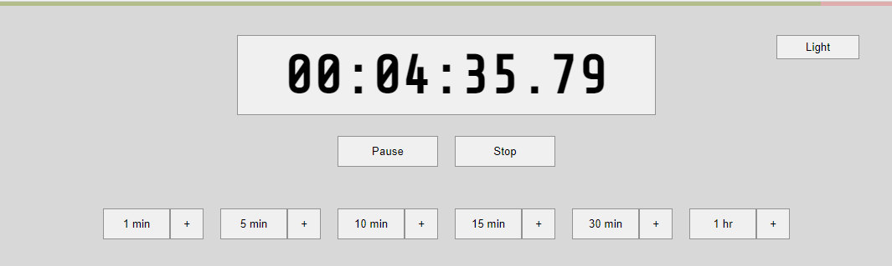

# Simple web-based countdown timer.

Minimalist client-side countdown timer with sound alert and voice notifications (on platforms that support Web Speech API and SpeechSynthesis).

You can use it [here](https://zenwarr.github.io/timer/).
